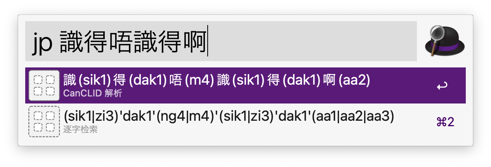

# Jyutping Alfred

在 Alfred 中用汉字快速查找粤语拼音。

Fast lookup for Jyutping in Alfred (macOS).

会同时显示 CanCLID 自动解析出的粤音和字典中逐字查找的可能音。

# Install

需先安装 Homebrew 并 `brew install python`。

之后请下载本仓库的 Release：https://github.com/ProfFan/jyutping-alfred/releases/download/1.0.0/Jyutping.alfredworkflow

最后在 Homebrew Python 3 环境下安装 ToJyutping: `/opt/homebrew/bin/pip3 install ToJyutping` 即可。

# Demo

# Thanks

https://github.com/CanCLID/ToJyutping

数据库来自于 《粵音資料集叢：典籍資料檔》
https://github.com/jyutnet/cantonese-books-data

# LICENSE

Apache 2.0
